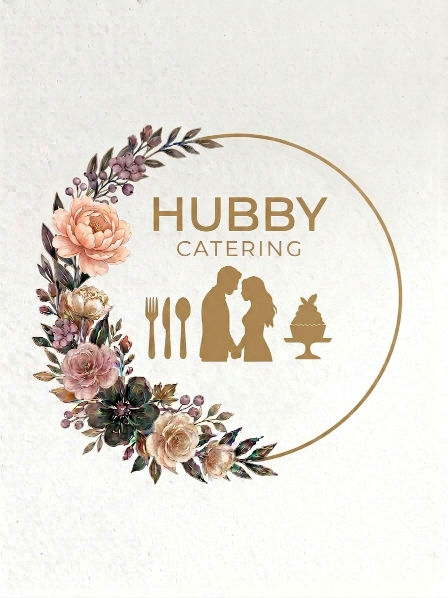

# Hubby Catering — Webová stránka

Moderní statická webová stránka pro cateringovou společnost **Hubby Catering**. Navržena s romantickým, elegantním stylem inspirovaným logem firmy.

## Technologie

- **Čistý HTML5 / CSS3 / Vanilla JavaScript** — žádné frameworky, žádný build krok
- **Google Fonts**: Cormorant Garamond (serif, romantický) + Inter (sans-serif, moderní)
- **Responsivní design** — mobile-first, breakpointy na 600 px a 860 px

---

## Struktura souborů

```
HubbyCatering/
├── index.html      # Hlavní stránka (veškerý obsah)
├── style.css       # Kompletní styly (proměnné, layout, animace)
├── script.js       # Interaktivita (scroll, slideshow, formulář…)
├── img/            # Fotografie a logo
│   ├── IMG_7396.PNG              # Hlavní logo (romantické florální)
│   └── WhatsApp Image *.jpeg    # Fotografie jídla a akcí
└── reels/          # Složka pro video reels (MP4 soubory)
```

---

## index.html — Sekce stránky

| Sekce | ID | Popis |
|---|---|---|
| Header | `#header` | Lepivá navigace s logem, které se zobrazí při scrollu |
| Hero | `#home` | Dvousloupcový layout — logo vlevo, text vpravo, foto pozadí |
| Stats bar | — | Tmavý pruh se statistikami (500+ akcí, 3 roky, 98%, 5000+) |
| O nás | `#o-nas` | Text + automatický slideshow 4 fotek (střídání každých 5 s) |
| Služby | `#sluzby` | 6 karet služeb (firemní, svatby, rauty, roznos jídla, dětské, privátní) |
| Jak to funguje | — | 4 kroky procesu (tmavá sekce) |
| Galerie | `#galerie` | Mřížka 6 fotografií (3 sloupce, čtvercový poměr stran) |
| Instagram / Reels | `#instagram` | Phone frame pro MP4 videa + odkaz na Instagram |
| Kontakt | `#kontakt` | Kontaktní informace + formulář s validací |
| Footer | — | Kulaté logo, navigace, ikona Instagramu, rok |

### Klíčové HTML prvky

**Hero sekce** — logo vlevo, text vpravo:
```html
<div class="hero-inner">
    <div class="hero-logo-wrap" id="hero-logo">
        
    </div>
    <div class="hero-content">
        <h1 class="hero-title">Hubby Catering</h1>
        <!-- ... tlačítka CTA ... -->
    </div>
</div>
```

**Logo v navigaci** — skryté na začátku, zobrazí se po scrollu:
```html
<a href="#home" class="logo">
    
</a>
```

---

## style.css — Klíčové části

### CSS proměnné (barevná paleta dle loga)
```css
:root {
    --clr-dark:       #1a0e06;   /* tmavá espresso (tmavé listy loga) */
    --clr-gold:       #b5883a;   /* bronzová (kroužek loga) */
    --clr-gold-light: #dbb96e;   /* světlá zlatá */
    --clr-rose:       #c47068;   /* peonková růžová */
    --clr-bg:         #faf6ee;   /* teplý pergamen */
    --clr-cream:      #f2e6d8;   /* krémová pro alternativní sekce */
}
```

### Logo — přechod hero → navigace
Logo existuje ve dvou instancích:
1. **Hero logo** (`#hero-logo`) — velké (280 × 280 px), kruhové, v hero sekci
2. **Nav logo** (`.logo`) — menší (72 × 72 px), skryté, zobrazí se scrollem

```css
/* Nav logo: skryté na začátku */
.logo { opacity: 0; transform: scale(0.85); transition: opacity .45s, transform .45s; }

/* Nav logo: viditelné po scrollu */
.site-header.scrolled .logo { opacity: 1; transform: scale(1); }
```

### Kulaté logo (všude)
```css
/* Vzor použitý pro nav logo, hero logo i footer logo */
border-radius: 50%;
background: #fff;
padding: 4–10px;
box-shadow: 0 2px 14px rgba(0,0,0,.3);
```

### Hero layout
```css
.hero-inner {
    display: grid;
    grid-template-columns: auto 1fr;
    gap: 5rem;
    align-items: center;
}
/* Na mobilu (≤ 860px) → jeden sloupec */
```

### Scroll reveal animace
```css
.reveal { opacity: 0; transform: translateY(32px); transition: opacity .6s, transform .6s; }
.reveal.visible { opacity: 1; transform: none; }
```

---

## script.js — Interaktivita

### 1. Scroll logo přechod
Práh 80 px — po scrollu:
- Hero logo dostane třídu `fade-out` → zmizí
- Header dostane třídu `scrolled` → nav logo se zobrazí

```js
const SCROLL_THRESHOLD = 80;
function updateHeader() {
    const scrolled = window.scrollY > SCROLL_THRESHOLD;
    header.classList.toggle('scrolled', scrolled);
    heroLogo.classList.toggle('fade-out', scrolled);
}
```

### 2. O nás Slideshow
Automatické střídání 4 fotografií každých 5 sekund. Klik na tečku resetuje časovač.

```js
setInterval(() => goTo(current + 1), 5000);
```

### 3. Mobilní navigace
Hamburger menu toggle — zamkne scroll stránky při otevření (`body.overflow: hidden`).

### 4. Scroll reveal (stagger)
`IntersectionObserver` sleduje `.reveal` prvky. Každý sourozenec se zobrazí s prodlevou 90 ms × index.

### 5. Video reels
`IntersectionObserver` spouští/zastavuje `<video>` prvky podle viditelnosti ve viewportu.

### 6. Kontaktní formulář
Validace: povinná pole (jméno, e-mail, zpráva) + regex pro e-mail.
> Pro skutečné odesílání napojte na [Formspree](https://formspree.io) nebo Netlify Forms.

### 7. Footer rok
Automaticky zobrazí aktuální rok pomocí `new Date().getFullYear()`.

---

## Jak spustit lokálně

Stránka je čistě statická — stačí otevřít `index.html` v prohlížeči.

Pro lepší zážitek (správné načítání fontů apod.) spusťte lokální server:

```bash
# Python
python -m http.server 8000

# Node.js (npx)
npx serve .
```

Pak otevřete `http://localhost:8000` v prohlížeči.

---

## Přizpůsobení

| Co změnit | Kde |
|---|---|
| Kontaktní údaje (tel., e-mail) | `index.html` → sekce `#kontakt` |
| Instagram odkaz / handle | `index.html` → hledat `instagram.com` |
| Barvy webu | `style.css` → blok `:root { --clr-* }` |
| Fotografie hero pozadí | `style.css` → `.hero-bg { background-image }` |
| Videa (Reels) | `reels/reel1.mp4`, `reel2.mp4`, `reel3.mp4` |
| Logo | `img/IMG_7396.PNG` (nebo změňte cestu v HTML) |

---

## Plánované vylepšení

- [ ] Napojení kontaktního formuláře na backend (Formspree / Netlify Forms)
- [ ] Přidání skutečných MP4 video reels
- [ ] SEO optimalizace (Open Graph, strukturovaná data)
- [ ] Google Analytics / Plausible tracking

---

*Hubby Catering — Gastronomie, která zanechá dojem.*
